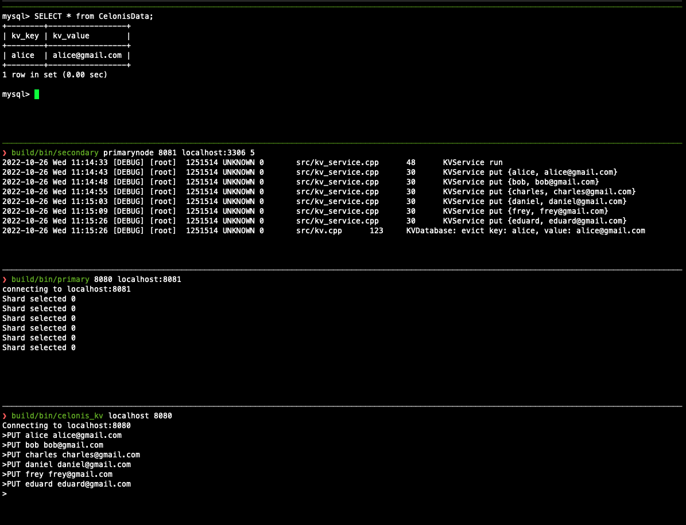

# Simple Distributed Key-Value-Store

Auther: Yuanchen Zhang

GitHub: https://github.com/alfmunny

## Changes

- Standalone docker build, no need to compile 3rd party libs if using Docker or Kubernetes
- Using Kubernetes Deployment instead of all instances in one Kubernetes Pod
- A shell tool `celonis_kv` to interact with the app
- Eviction using mysql as persistent database feature added
- Kubernetes Deployment with persistent database

## Architect

- Primary Node
    - Static list of secondary nodes
    - Exposes RPC services
        - Static mapping
        - Map key to an unique shard(one secondary node)
    - Dockerized

- Secondary Node
    - Provide the Key-Value Storage
    - Read Write Lock to separate the read and write IO
    - Eviction policy with LRU is implemented
        - It uses a hash map and a double linked list
        - The capacity is the numebr of records, can be while initialisation
    - Dockerized

- Persistent DB Node
    - MySQL
    - Maintain the evicted data from the secondary nodes.

- Kubernetes
    - Coordinate the primary nodes, secondary nodes and persistent mysql database.
    - Configura using yaml file
    - Watchdog, replica, etc..

Advanced(ideas, not implemented):

- Dynamic scaling with service discovery
    - Heartbeat from secondary nodes to primary node
    - Regester the secondary nodes onto primary node while receiving heartbeat.
    - Zookeeper
    - Use a look up table on primary node to mark the shard ID corresponding a specific key
- How to improve performance:
    - Coroutine with a thread pool to handle the IO between primary and the secondary and also the mysql
        - Lightweight Coroutine implemented with Event-based (epoll) context switch.
        - All the socket family blocking IO needs to be hooked, bend them into coroutine.
        - Then we schedule a ton of IO events in each thread.
        - Coding the asychrounous behavior in a synchronous non-blocking manner.
    - Connection pool may be needed
    - Configure the granulity of the locks carefully.


## Structure

```
- include (headers)
- lib (3rd-party libs)
- src (source code)
    - kv.cpp (storage and eviction policy)
    - kv_service.cpp (service code with RPC)
    - kv_primary.cpp (service of primary node, sharding logic)
- primary.cpp (compiles to executable "primary", program for starting a primary node)
- secondary.cpp (compiles to executable "secondary", program for starting a secondary node)
- main.cpp (compiles to executable "main", a simple test demo)
- celonis_kv.cpp (compiles to executable "celonis_kv", a simple interactive "shell-like" client)
```

## Library

- [rpclib](https://github.com/rpclib/rpclib): simple RPC communication
- [EVA01](https://github.com/alfmunny/EVA01)(self-written library): For logging, read-write mutex, timer, thread-pool, fiber, iomanager and etc. .

## Build

- Linux and ARM 64bit (The libs may not be compatible on other platforms, or you can build your own libs with source code of [rpclib](https://github.com/rpclib/rpclib) and [EVA01](https://github.com/alfmunny/EVA01) and copy them into lib)
- Use the Kubernetes and docker to run is highly recommanded, so you don't need to build the 3rd party libraries yourself.
- gcc-9
- cmake 3.22
- libmysqlcppconn-dev has to be installed for the c++ connector to the mysql database for persistency feature
    - `sudo apt-get install libmysqlcppconn-dev`

Start building:

```bash
cmake .
make
```

## Run

The executable would appear in `./bin`.

Usage will be shown when no arguments are given:

```bash
bin/secondary
```

```
Usage:

       secondary primary port persistent_node capacity eviction_policy thread_pool_size

       - primary: domain name or address and port of the primary node
       - port: port to use for this secondary node
       - (Optional) persistent_node: domain name or address and port of the persistent node
       - (Optional) capacity: capacity of the in-memory db in number, default is 1.000.000 records
       - (Optional) policy: eviction policy when capacity reached, 1: LRU, 2: LFU, 3: FIFO. default is 1.
       - (Optional) thread_pool_size: thread pool size, default is 1
```

### Start secondary nodes

Let's start 2 secondary nodes

```bash
bin/secondary localhost:8080 8081
bin/secondary localhost:8080 8082
```

## Start primary node

Now start the primary node:

```bash
bin/primary 8080 localhost:8081 localhost:8082
```

### Run test

Run the example [simple RPC client](./main.cpp).

It tries to "PUT" some value and "GET" them back.

Run test:

```bash
bin/main localhost 8080
```
### Interact with database

Run the simple "shell-like" program `celonis_kv` to interact with the databse:

```bash
bin/celonis_kv localhost 8080
> GET bob ""

> PUT bob bob@gmail.com
> GET bob ""
bob@gmail.com
> PUT alice alice@gmail.com
...
```

You can also do it in a container if you have the Kubrenetes environment set up. 
```bash
docker run -it --rm --network=host celonis-kv bin/celonis_kv 192.168.49.2 30409
Connecting to 192.168.49.2:30409
>PUT bob bob@gmail.com
>GET bob ""
bob@gmail.com
>
```

Please refer the chapter of Kubernetes deployment about the steps.

### Run persistent database for eviction locally

Set up the mysql server.
The default user and password(text-based for now) for the database to connect into is:

```
user: root
password: password
```

The program can accept optional arguments to connect to mysql database.
Let's set the capacity limit for eviction to 5:

```bash
build/bin/secondary localhsot:8080 8081 localhost:3306 5
bin/primary 8080 localhost:8081
```

Start test the eviction with `celonis_kv`:

```bash
build/bin/celonis_kv localhost 8080
>PUT alice alice@gmail.com
>PUT bob bob@gmail.com
>PUT charles charles@gmail.com
>PUT daniel daniel@gmail.com
>PUT frey frey@gmail.com
>PUT eduard eduard@gmail.com
>
```

The least recent one "alice" will be evicted to mysql database
```
mysql> SELECT * from CelonisData;
+--------+-----------------+
| kv_key | kv_value        |
+--------+-----------------+
| alice  | alice@gmail.com |
+--------+-----------------+
1 row in set (0.00 sec)

```



## Deploy with Kubernetes

### Build image for Kubernetes

Start `minikube` locally.

```bash
minikube config set driver docker
eval $(minikube docker-env)
docker build . -t celonis-kv
```
### Deploy with Kubernetes Deployment

Each instance has its own pod.
Let's create all the Kubernetes deployments

Deploy persistent database MySQL:

```bash
kubectl apply -f mysql-pv.yaml
kubectl apply -f mysql-deployment.yaml
```

Deploy 2 secondary nodes:

```bash
kubectl apply -f deploy_node1.yaml
kubectl apply -f deploy_node2.yaml
```

Deploy the primary node:

```bash
kubectl apply -f deploy_primary.yaml
```

Overwatch logs

```bash
kubectl logs deployments/secondary-kv-1 -f
kubectl logs deployments/secondary-kv-2 -f
```

Get the service address of the primary node:

```bash
minikube service primary-kv --url
http://192.168.49.2:30409
```

Interact with the apps in container using local network with this address:
```bash
docker run -it --rm --network=host celonis-kv bin/celonis_kv 192.168.49.2 30409
Connecting to 192.168.49.2:30409
>PUT bob bob@gmail.com
>GET bob ""
bob@gmail.com
>
```
