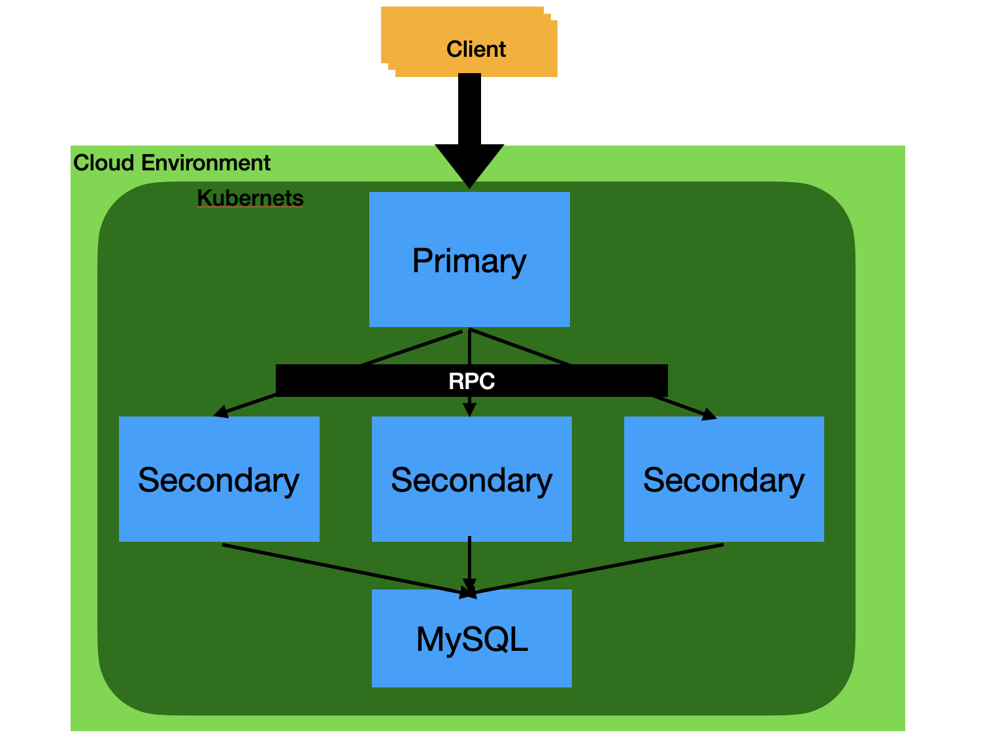

# Distributed Key-Value-Store Celonis Challenge

Auther: Yuanchen Zhang
GitHub: https://github.com/alfmunny

## Architect

- Primary Node
    - Static list of secondary nodes
    - Exposes RPC services
    - Accept requests from clients
    - Simple implementation of sharding.
        - Static mapping
        - Map key to an unique shard(one secondary node)
    - Dockerized
- Secondary Node
    - Provide the Key-Value Storage
    - Read Write Lock to separate the read and write IO
    - Dockerized
- Kubernetes
    - Configure the nodes
    - Load Balancing
    - Watchdog, replica, etc..

Advanced(ideas): 
- Dynamic scaling with service discovery
    - Heartbeat from secondary nodes to primary node
    - Regester the secondary nodes onto primary node while receiving heartbeat.
    - Zookeeper



## Library

- [rpclib](https://github.com/rpclib/rpclib): simple RPC communication
- [EVA01](https://github.com/alfmunny/EVA01)(self-written library): For logging, read-write mutex, timer, thread-pool, fiber, iomanager and etc. .

## Build local

- Linux
- gcc-9

## Build in docker

Build the image in docker

```bash
docker build . -t celonis-kv
```

## Run

### Start secondary nodes

Secondary node 1 on 8081:

```bash
docker run -ti -p 8081:8081 celonis-kv bin/secondary localhost:8080 8081
```

Secondary node 2 on 8082:

```bash
docker run -ti -p 8081:8081 celonis-kv bin/secondary localhost:8080 8081
```

### Start primary nodes

```bash
docker run -ti -p 8080:8080 celonis-kv bin/primary 8080 172.17.0.2:8081 172.17.0.3:8082
```

### Test with client

Connect to the primary nodes

```bash
docker run -ti celonis-kv bin/main localhost 8080
```

## Deploy with Kubernetes

### Build image for Kubernetes

```bash
minikube config set driver docker
eval $(minikube docker-env)
docker build . -t celonis-kv
```

### Deploy Pod as celonis-kv-pod: 

For example using the [deploy.yaml](./deploy.yaml):

- One Primary Node, exposes on 8080
- Two Second Node

```bash
kubectl apply -f deploy.yaml
```

We can already access in the cluster.

Let's test the distributed services with our test program [main.cpp](./main.cpp)

It tries to "PUT" some value and "GET" them back.

```bash
kubectl exec -it celonis-kv-pod -- sh

# bin/main 127.0.0.1 8080
```

### Expose Service

Expose 8080
```
kubectl expose pod celonis-kv-pod --type=NodePort --port=8080 --target-port=8080
```

Get the NodePort
```
kubectl get service celonis-kv-pod --output yaml

...
...
ports:
  - nodePort: 30234
    port: 8080
    protocol: TCP
    targetPort: 8080
...

```

The NodePort is 30234.

Get the IP address.
```bash
kubectl get nodes --output wide

NAME       STATUS   ROLES           AGE    VERSION   INTERNAL-IP    EXTERNAL-IP   OS-IMAGE             KERNEL-VERSION     CONTAINER-RUNTIME
minikube   Ready    control-plane   116m   v1.25.2   192.168.49.2   <none>        Ubuntu 20.04.5 LTS   5.15.49-linuxkit   docker://20.10.18
```


Access the service from local machine (`--network=host` is used):

```
docker run -ti --rm --network=host celonis-kv bin/main 192.168.49.2 8080
```
